# RainClaw

RainClaw 是一个强大的智能代理系统，旨在帮助用户解决问题、进行研究和高效完成任务。它基于先进的 LLM 技术，支持多种模型，并提供了丰富的技能和工具扩展系统。

## 系统特色

RainClaw 具有以下核心特色，为用户提供安全、高效、个性化的智能助手体验：

### 🔒 多用户隔离与安全保障
- **多用户支持**：允许多个用户同时使用系统，每个用户拥有独立的账户和权限
- **用户隔离机制**：严格的用户数据隔离，确保个人信息和会话内容安全
- **会话隔离机制**：每个会话独立运行，互不干扰
- **完全沙箱执行**：所有代码和工具执行都在隔离的沙箱环境中进行，保障系统安全性

### 🎨 自定义垂直领域工作
- 可根据用户需求创建和定制特定领域的技能和工具
- 与 RainClaw 直接沟通，快速构建适合自身业务场景的智能助手
- 支持行业特定知识的集成和应用

### 📱 直观的会话界面
- 简洁明了的会话界面，提供流畅的用户体验
- 清晰展示 AI 的推理过程，让用户了解决策逻辑
- 实时显示沙箱中的执行动作，增强透明度和可追溯性

### 🛠️ 丰富的技能生态
- 内置多种实用技能，覆盖 brainstorming、文案写作、深度研究等多个领域
- 技能库支持在线浏览和管理，方便用户快速找到所需功能
- 支持用户自定义技能，扩展系统能力

### 🤖 灵活的模型选择
- 支持多种主流 LLM 模型，包括 OpenAI、Google Gemini、Anthropic Claude 等
- 模型可自由切换，根据任务需求选择最适合的模型
- 提供模型参数配置，优化性能和成本

### 💰 Token 消耗可视化
- 实时显示 token 消耗情况，帮助用户了解使用成本
- 提供详细的 token 使用统计，便于成本管理
- 支持设置 token 使用限制，避免过度消耗

### 🧠 智能记忆系统
- 自定义用户全局记忆，存储个人偏好和常用信息
- 跨会话持久化记忆，提供连续的用户体验
- 会话级记忆管理，确保上下文的连贯性

### 📲 多渠道集成
- 支持飞书等即时通讯平台的集成
- 可在不同渠道进行会话，保持一致的用户体验
- 消息同步和通知功能，确保信息及时传递

### 🌐 网站开发与部署
- 支持通过自然语言指令开发完整网站
- 集成阿里云自动化部署功能，实现一键部署
- 提供网站构建、测试和部署的全流程支持

## 界面展示

### 登录界面
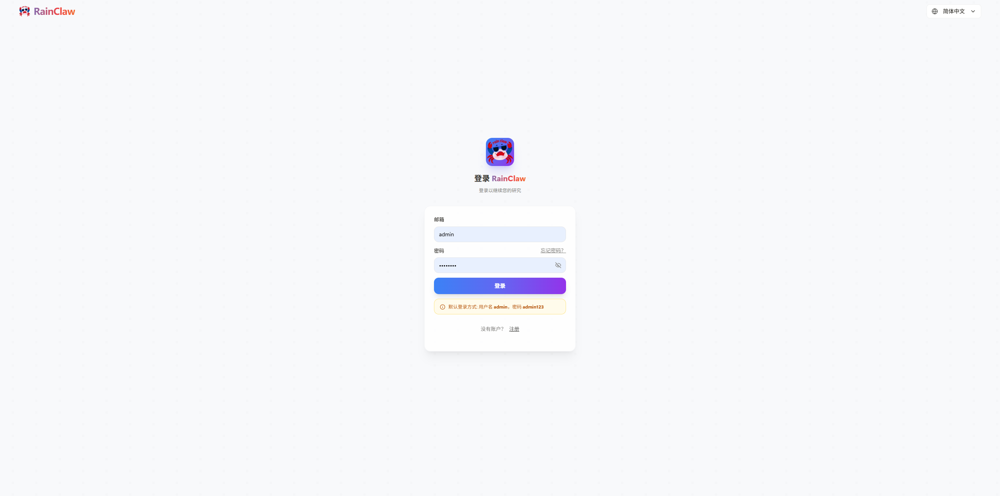
支持多用户登录，具备用户隔离和会话隔离机制，保障系统安全性。

### 首页
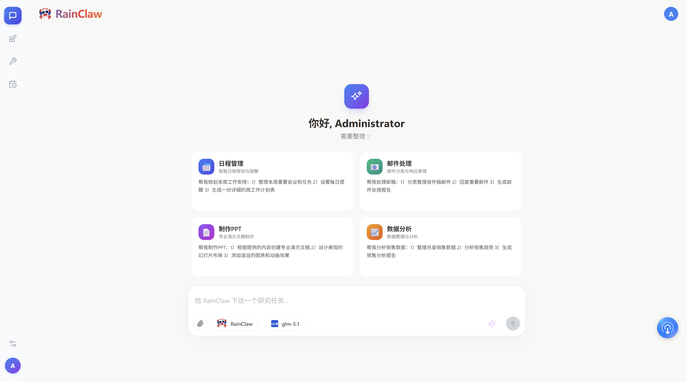
可自定义垂直领域的工作，与 RainClaw 沟通创建自身领域的 skills 和 tools。

### 会话界面
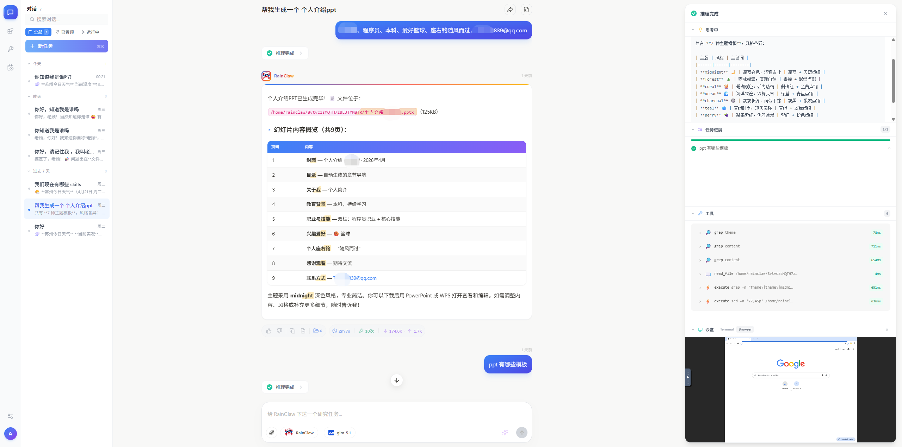
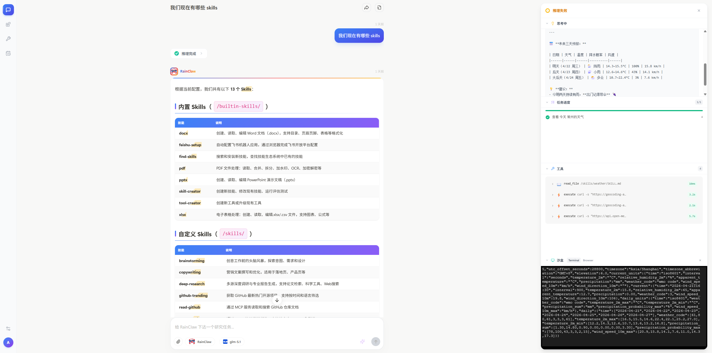
会话界面简洁明了，清晰展示 AI 的推理过程，以及沙箱中的执行动作。

### 技能库
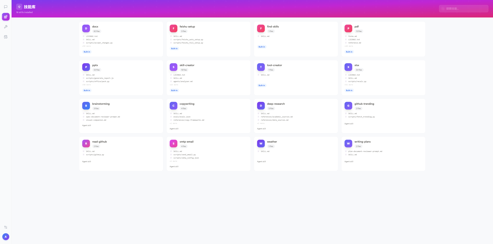
丰富的技能生态，支持在线浏览技能内容和管理。

### 模型切换
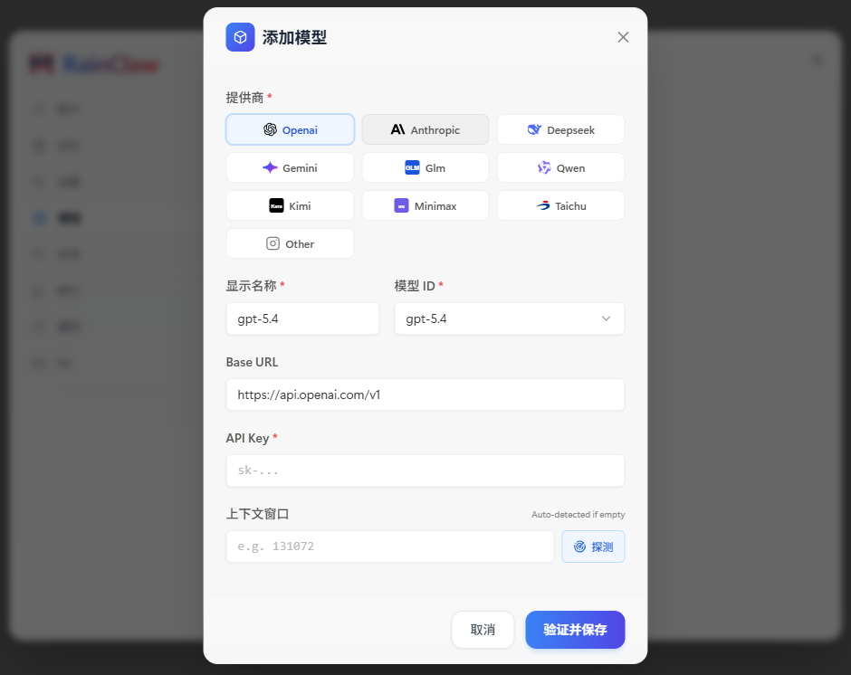
灵活的模型选择，可根据任务需求自由切换不同的 LLM 模型。

### Token 消耗
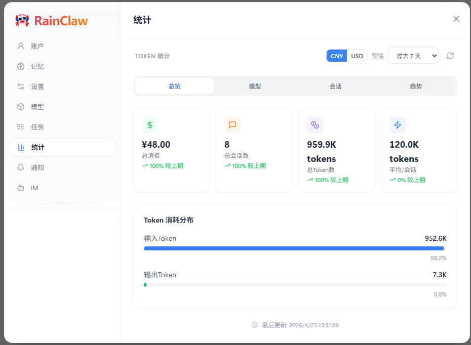
Token 消耗可视化，实时显示使用情况，帮助用户管理成本。

### 记忆系统
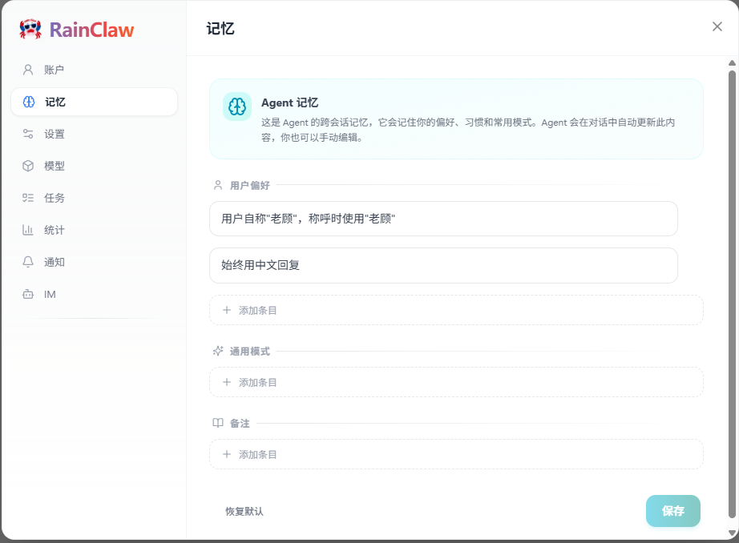
自定义用户全局记忆，存储个人偏好和常用信息，提供连续的用户体验。

### 飞书集成
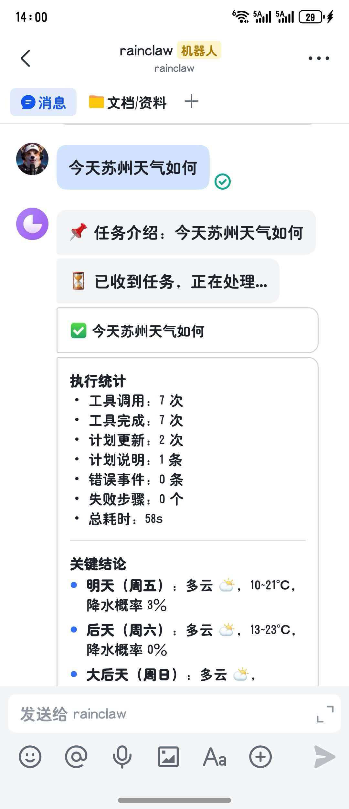
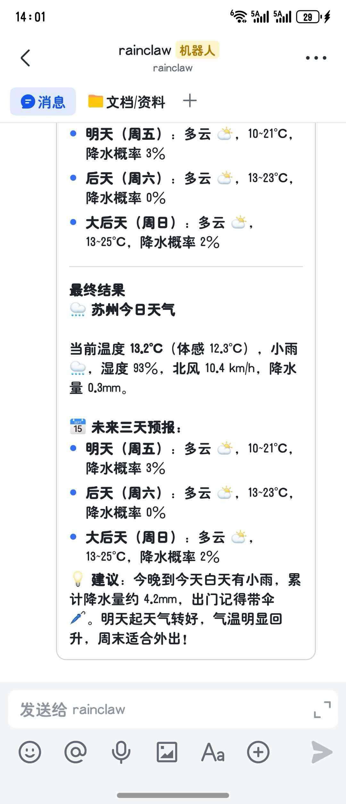
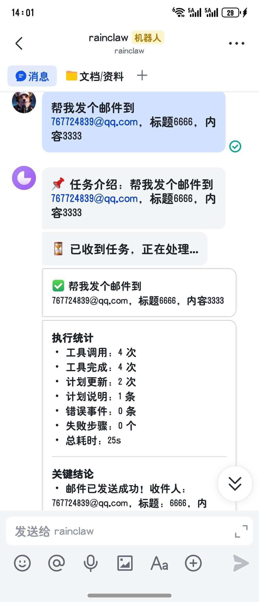
支持飞书等即时通讯平台的集成，可在不同渠道进行会话。

### 定时任务
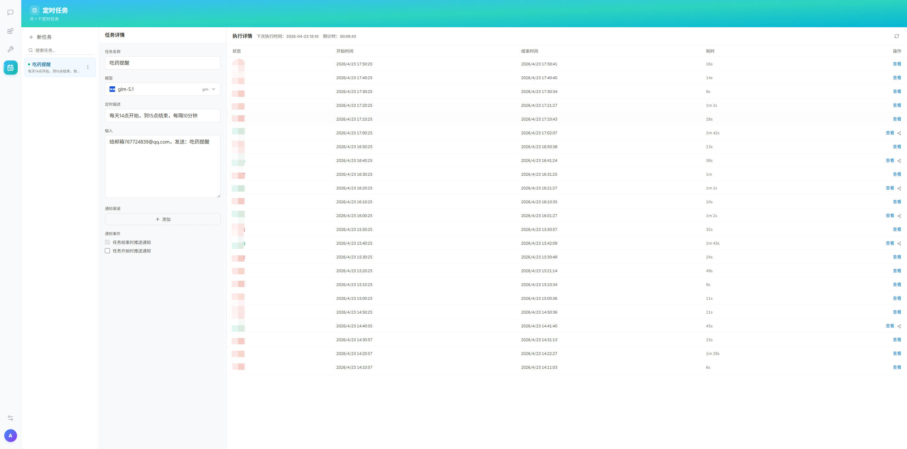
自定义定时任务，任务明细一目了然。

### 网站部署
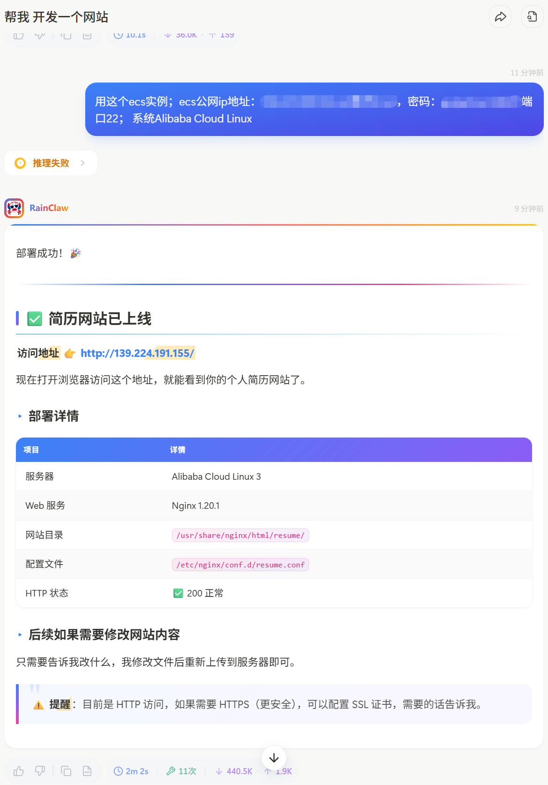
支持通过自然语言进行阿里云自动化部署，实现网站的快速构建和部署。

## 项目结构

```
RainClaw/
├── Skills/              # 技能模块目录
│   ├── brainstorming/   # 头脑风暴技能
│   ├── copywriting/     # 文案写作技能
│   ├── deep-research/   # 深度研究技能
│   ├── github-trending/ # GitHub 趋势技能
│   ├── read-github/     # GitHub 读取技能
│   ├── smtp-email/      # 邮件发送技能
│   ├── weather/         # 天气查询技能
│   └── writing-plans/   # 计划写作技能
├── Tools/               # 工具扩展目录
│   └── __init__.py
├── rainclaw/            # 核心代码目录
│   ├── backend/         # 后端代码
│   │   ├── builtin_skills/ # 内置技能
│   │   │   ├── docx/     # Word 文档处理
│   │   │   ├── feishu-setup/ # 飞书集成设置
│   │   │   ├── find-skills/ # 技能发现
│   │   │   ├── pdf/      # PDF 文档处理
│   │   │   ├── pptx/     # PowerPoint 处理
│   │   │   ├── skill-creator/ # 技能创建器
│   │   │   ├── tool-creator/ # 工具创建器
│   │   │   └── xlsx/     # Excel 文档处理
│   │   ├── deepagent/   # 深度代理实现
│   │   ├── im/          # 即时通讯集成
│   │   │   └── adapters/ # 适配器（如飞书）
│   │   ├── mongodb/     # MongoDB 连接
│   │   ├── route/       # API 路由
│   │   ├── user/        # 用户管理
│   │   ├── config.py    # 配置文件
│   │   ├── main.py      # 主应用入口
│   │   └── requirements.txt # 项目依赖
│   ├── frontend/        # 前端代码
│   │   ├── public/      # 静态资源
│   │   ├── src/         # 源代码
│   │   │   ├── api/     # API 客户端
│   │   │   ├── components/ # 组件
│   │   │   │   ├── filePreviews/ # 文件预览
│   │   │   │   ├── icons/      # 图标
│   │   │   │   ├── login/      # 登录相关
│   │   │   │   ├── settings/   # 设置相关
│   │   │   │   ├── toolViews/  # 工具视图
│   │   │   │   └── ui/         # UI 组件
│   │   │   ├── composables/ # 组合式函数
│   │   │   └── App.vue    # 主应用组件
│   │   ├── package.json # 前端依赖
│   │   └── vite.config.ts # Vite 配置
├── .gitignore           # Git 忽略文件
├── AGENTS.md            # 代理配置文件
├── LICENSE              # 许可证文件
├── README.md            # 项目说明文件
└── docker-compose.yml   # Docker 编排配置
```

## 核心功能

### 1. 多模型支持
- 支持 OpenAI、Google Gemini、Anthropic Claude、DeepSeek、Kimi、Qwen 等多种 LLM 模型
- 模型配置灵活，可根据任务选择最适合的模型

### 2. 技能系统
- **内置技能**：
  - brainstorming：头脑风暴，用于创意生成和问题解决
  - copywriting：文案写作，用于生成营销文案和内容
  - deep-research：深度研究，用于复杂主题的调研和分析
  - github-trending：GitHub 趋势，获取热门开源项目
  - read-github：读取 GitHub 仓库内容
  - smtp-email：邮件发送，通过 SMTP 发送电子邮件
  - weather：天气查询，获取实时天气信息
  - writing-plans：计划写作，生成项目计划和任务列表

- **文档处理技能**：
  - docx：Word 文档处理，支持读取、编辑和生成
  - pdf：PDF 文档处理，支持提取内容和表单
  - pptx：PowerPoint 演示文稿处理
  - xlsx：Excel 电子表格处理

- **工具创建技能**：
  - skill-creator：创建新技能的工具
  - tool-creator：创建新工具的工具

### 3. 工具扩展系统
- 支持自定义工具扩展，实现功能增强
- 内置工具包括：
  - web_search：网络搜索，获取最新信息
  - web_crawl：网页爬取，获取网页内容
  - propose_skill_save：保存新技能
  - propose_tool_save：保存新工具
  - eval_skill：评估技能性能
  - grade_eval：评估结果评分

### 4. 前端功能
- **现代化界面**：基于 Vue 3 + TypeScript + Tailwind CSS 构建
- **文件管理**：支持多种文件类型的预览和管理
  - 代码文件：语法高亮显示
  - 文档文件：Word、PDF、Excel 预览
  - 图片文件：直接预览
  - 分子文件：3D 分子结构查看
- **实时交互**：基于 SSE 的实时消息更新
- **多语言支持**：支持中文和英文响应
- **设置管理**：用户账户、模型、通知等设置

### 5. 后端功能
- **API 服务**：基于 FastAPI 的 RESTful API
- **异步处理**：使用 Python 异步特性提高性能
- **数据库集成**：MongoDB 用于数据存储
- **即时通讯**：飞书集成，支持消息推送
- **沙箱执行**：安全的代码执行环境，隔离执行风险
- **记忆系统**：跨会话记忆和会话级上下文管理

### 6. 部署与集成
- **Docker 支持**：容器化部署，简化环境配置
- **环境变量配置**：灵活的配置管理
- **多平台支持**：支持 Windows、Linux、MacOS

## 技术栈

### 前端技术栈
- **框架**：Vue 3 + TypeScript
- **构建工具**：Vite
- **样式**：Tailwind CSS
- **UI 组件**：Reka UI
- **状态管理**：Vue 3 Composition API
- **路由**：Vue Router
- **国际化**：Vue I18n
- **HTTP 客户端**：Axios
- **实时通信**：SSE (Server-Sent Events)
- **代码编辑器**：Monaco Editor
- **终端模拟器**：xterm.js
- **VNC 查看器**：noVNC
- **Markdown 渲染**：Marked + KaTeX + Mermaid
- **动画**：Framer Motion

### 后端技术栈
- **语言**：Python 3.12+
- **Web 框架**：FastAPI
- **异步服务器**：Uvicorn
- **数据验证**：Pydantic V2
- **数据库**：MongoDB (Motor 异步驱动)
- **LLM 集成**：LangChain、DeepAgents、LangGraph
- **事件流**：SSE (Server-Sent Events)
- **即时通讯**：飞书 API
- **网络搜索**：Tavily API
- **容器化**：Docker

## 使用指南

### 1、Docker 镜像启动（推荐）

#### 安装 Docker Desktop

**Windows 系统：**
1. 访问 [Docker Desktop 官方下载页面](https://www.docker.com/products/docker-desktop)
2. 下载适用于 Windows 的 Docker Desktop 安装包
3. 运行安装程序并按照提示完成安装
4. 安装完成后，启动 Docker Desktop

**macOS 系统：**
1. 访问 [Docker Desktop 官方下载页面](https://www.docker.com/products/docker-desktop)
2. 下载适用于 macOS 的 Docker Desktop 安装包
3. 打开下载的 .dmg 文件并将 Docker 图标拖到 Applications 文件夹
4. 启动 Docker Desktop 并按照提示完成初始化

**Linux 系统：**
1. 按照 [Docker 官方文档](https://docs.docker.com/engine/install/) 安装 Docker Engine
2. 安装 Docker Compose（如果未包含在 Docker Engine 中）

安装完成后，确保 Docker 服务正在运行，然后执行以下命令启动服务：

#### 启动所有服务
```bash
docker-compose up -d
```

#### 重新启动后端
```bash
docker-compose up -d --build backend
```

#### 重新启动前端
```bash
npm run build
docker-compose up -d --build frontend
```
### 2、本地启动

#### 启动 Redis
```bash
# 安装 Redis（如果未安装）
# Windows: 下载并安装 Redis 或使用 WSL
# Linux: sudo apt install redis-server
# MacOS: brew install redis

# 启动 Redis 服务
# Windows (WSL): sudo service redis-server start
# Linux: sudo service redis-server start
# MacOS: brew services start redis
```

#### 启动 MongoDB
```bash
# 安装 MongoDB（如果未安装）
# Windows: 下载并安装 MongoDB Community Server
# Linux: sudo apt install mongodb
# MacOS: brew install mongodb-community

# 启动 MongoDB 服务
# Windows: net start MongoDB
# Linux: sudo service mongodb start
# MacOS: brew services start mongodb-community

# 创建用户和数据库
mongo --eval "use admin; db.createUser({user: 'rainclaw', pwd: 'Yp51Bi1eEjC77sAt', roles: [{role: 'root', db: 'admin'}]})"
```

#### 启动 SearXNG
```bash
# 克隆 SearXNG 仓库
git clone https://github.com/searxng/searxng.git
cd searxng

# 安装依赖
pip install -r requirements.txt

# 配置 settings.yml
cp searxng/settings.yml.sample searxng/settings.yml

# 启动 SearXNG
python -m searxng
```

#### 启动 WebSearch
```bash
cd rainclaw/websearch
# 安装依赖
pip install -r requirements.txt

# 设置环境变量
export SEARXNG_HOST=localhost
export SEARXNG_PORT=8888
export API_HOST="0.0.0.0"
export API_PORT=8068
export API_KEY="fdsfkjikmii"

# 启动 WebSearch 服务
python main.py
```

#### 启动 Sandbox
```bash
cd rainclaw/sandbox
# 安装依赖
pip install -r requirements.txt

# 设置环境变量
export WEBSEARCH_URL=http://localhost:8068

# 启动 Sandbox 服务
python main.py
```

#### 启动后端
```bash
cd rainclaw/backend
# 安装依赖
pip install -r requirements.txt

# 设置环境变量
export SANDBOX_REST_URL=http://localhost:8080
export WORKSPACE_DIR=/home/rainclaw
export API_KEY={API_KEY:-}
export API_BASE=https://api.deepseek.com/v1
export MODEL_NAME=deepseek-chat
export TEMPERATURE=0.7
export MAX_TOKENS=2000
export LOG_LEVEL=INFO
export FILE_DOWNLOAD_ALLOWED_PREFIXES=/tmp,/app,/home/rainclaw
export AUTH_PROVIDER=local
export REDIS_HOST=localhost
export REDIS_PORT=6379
export REDIS_PASSWORD=""
export REDIS_DB=0
export BOOTSTRAP_ADMIN_ENABLED="true"
export BOOTSTRAP_ADMIN_USERNAME=admin
export BOOTSTRAP_ADMIN_PASSWORD=admin123
export BOOTSTRAP_ADMIN_FULLNAME=Administrator
export BOOTSTRAP_ADMIN_EMAIL=admin@localhost
export BOOTSTRAP_UPDATE_ADMIN_PASSWORD="true"
export MONGODB_HOST=localhost
export MONGODB_PORT=27017
export MONGODB_USER=rainclaw
export MONGODB_PASSWORD=Yp51Bi1eEjC77sAt
export TASK_SERVICE_API_KEY={TASK_SERVICE_API_KEY:-}
export WEBSEARCH_API_KEY="fdsfkjikmii"
export WEBSEARCH_BASE_URL=http://localhost:8068
export WEBSEARCH_URL=http://localhost:8068
export DIAGNOSTIC_MODE="1"
export IM_ENABLED="true"
export IM_RESPONSE_TIMEOUT=300
export IM_MAX_MESSAGE_LENGTH=4000
export LARK_ENABLED="true"
export LARK_APP_ID={LARK_APP_ID-}
export LARK_APP_SECRET={LARK_APP_SECRET-}

# 启动后端服务
uvicorn main:app --reload
```

#### 启动任务调度服务
```bash
cd rainclaw/task-service
# 安装依赖
pip install -r requirements.txt

# 设置环境变量
export TZ=Asia/Shanghai
export DISPLAY_TIMEZONE=Asia/Shanghai
export MONGODB_HOST=localhost
export MONGODB_PORT=27017
export MONGODB_DB=ai_agent
export MONGODB_USER=rainclaw
export MONGODB_PASSWORD=Yp51Bi1eEjC77sAt
export REDIS_URL=redis://localhost:6379/0
export CHAT_SERVICE_URL=http://localhost:8000
export CHAT_SERVICE_API_KEY={TASK_SERVICE_API_KEY:-}
export API_KEY={API_KEY:-}
export API_BASE=https://api.deepseek.com/v1
export MODEL_NAME=deepseek-chat

# 启动任务调度 API
uvicorn app.main:app --host 0.0.0.0 --port 8001

# 另开终端启动 Celery Worker
cd rainclaw/task-service
celery -A app.celery_app worker --loglevel=info

# 另开终端启动 Celery Beat
cd rainclaw/task-service
celery -A app.celery_app beat --loglevel=info
```

#### 前端开发
```bash
cd rainclaw/frontend
# 安装依赖
npm install

# 设置环境变量
export BACKEND_URL=http://localhost:8000
export TASK_SERVICE_URL=http://localhost:8001
export VITE_DISPLAY_TIMEZONE=Asia/Shanghai

# 启动前端开发服务器
npm run dev
```

## 技能系统详解

### 技能结构
每个技能包含以下部分：
- **SKILL.md**：技能描述和配置
- **scripts/**：技能实现脚本
- **references/**：参考资料
- **evals/**：评估测试

### 技能开发流程
1. 定义技能目的和功能
2. 编写技能实现脚本
3. 创建技能配置文件
4. 测试技能功能
5. 部署到系统中

## 工具系统详解

### 工具类型
- **内置工具**：系统预定义的工具
- **自定义工具**：用户或开发者创建的工具
- **第三方工具**：通过 API 集成的外部工具

### 工具调用流程
1. 用户或技能请求使用工具
2. 系统验证工具权限
3. 执行工具操作
4. 返回工具执行结果
5. 处理工具执行结果

## 工作流程

1. **理解与计划**：分析用户需求，制定执行计划
2. **执行**：使用技能或工具完成任务
3. **验证与交付**：检查任务完成情况，交付结果
4. **反思与捕获**：总结经验，更新记忆系统

## 记忆系统

RainClaw 采用两层记忆系统：

- **全局记忆** (AGENTS.md)：存储用户偏好和通用模式，跨所有会话持久化
- **会话记忆**：存储当前项目/任务上下文，会话结束后自动清理

## 配置说明

### 模型配置

- `MODEL_DS_NAME`：模型名称，如 gpt-4o、claude-3-opus 等
- `MODEL_DS_BASE_URL`：模型 API 基础 URL
- `MODEL_DS_API_KEY`：模型 API 密钥
- `CONTEXT_WINDOW`：模型上下文窗口大小

### 应用配置

- `MAX_TOKENS`：模型最大输出 tokens
- `SANDBOX_EXEC_TIMEOUT`：沙箱执行超时时间
- `MAX_OUTPUT_CHARS`：最大输出字符数

## 贡献指南

1. ** Fork 项目**
2. **创建功能分支**
3. **提交更改**
4. **创建 Pull Request**

## 许可证

本项目采用 MIT 许可证。详见 [LICENSE](LICENSE) 文件。

## 鸣谢

- [LangChain](https://www.langchain.com/)：LLM 应用开发框架
- [DeepAgents](https://github.com/deepagents-ai/deepagents)：深度代理系统
- [FastAPI](https://fastapi.tiangolo.com/)：现代 Web 框架
- [Vue 3](https://vuejs.org/)：前端框架
- [Tailwind CSS](https://tailwindcss.com/)：实用优先的 CSS 框架

---

**RainClaw** - 您的智能任务助手，让复杂任务变得简单！

## 自定义镜像仓库方法
1. 构建镜像：
   ```bash
   docker build -t image_name:tag_name .
   ```

2. 阿里云镜像仓库, 并标签镜像：
   ```bash
   docker tag image_name:tag_name crpi-st7s4gabmi4ym1qo.cn-shanghai.personal.cr.aliyuncs.com/rainclaw/image_name:tag_name
   ```

3. 推送镜像：
   ```bash
   docker push crpi-st7s4gabmi4ym1qo.cn-shanghai.personal.cr.aliyuncs.com/rainclaw/image_name:tag_name
   ```
